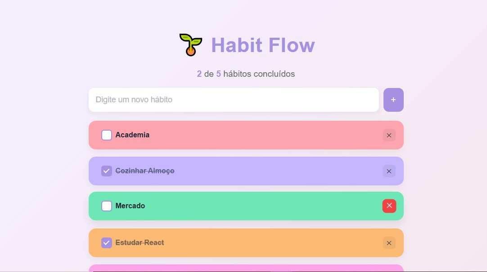

# HabitFlow — Habit Tracker App

Este projeto é uma aplicação web para **gerenciamento e acompanhamento de hábitos diários**.

O foco foi desenvolver uma interface **moderna, minimalista e interativa**, aplicando conceitos fundamentais de React como **useState e useEffect**, além de trabalhar **persistência de dados com localStorage** e atenção à experiência do usuário.

---

## 📸 Preview

---

## 🎯 Objetivo do Projeto

Criar uma aplicação simples, para consolidar conceitos essenciais de **React**, incluindo:

- Gerenciamento de estado com `useState`
- Efeitos colaterais com `useEffect`
- Persistência de dados com `localStorage`
- Manipulação de listas (CRUD completo)
- Microinterações e feedback visual

---

## 🛠️ Tecnologias Utilizadas

- **React.js (Vite)**
- **JavaScript (ES6+)**
- **CSS3**
  - Flexbox
  - Responsividade com Media Queries
  - Animações com CSS
- **LocalStorage (Web API)**

---

## 📚 Possíveis Melhorias Futuras

- Adicionar animações avançadas (ex: Framer Motion)
- Implementar sistema de categorias de hábitos
- Criar progresso semanal/mensal
- Adicionar dark mode
- Sincronização com backend (API)
- Refatorar para TypeScript
- Melhorar acessibilidade (ARIA, navegação por teclado)

---

## 🔗 Links

- 💻 **Link do projeto**  
  https://estefpimenta.github.io/habit-flow/

---